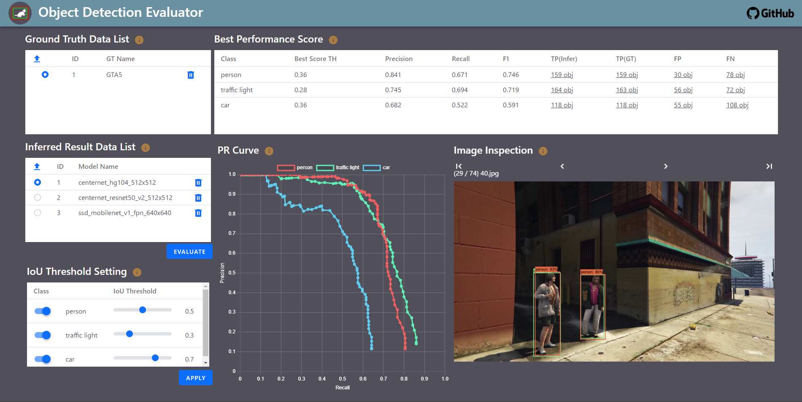
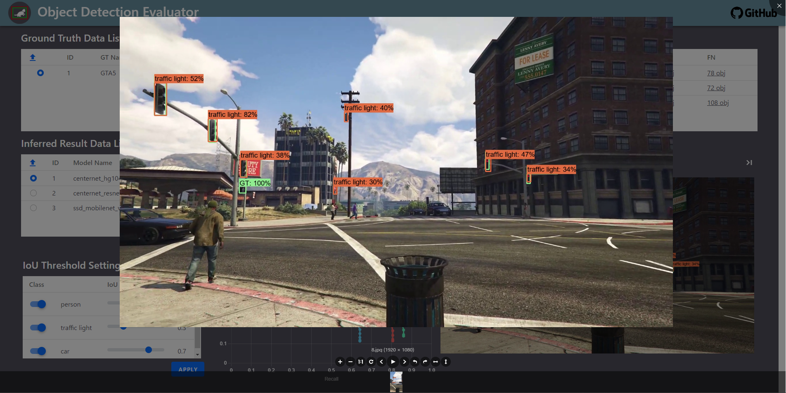
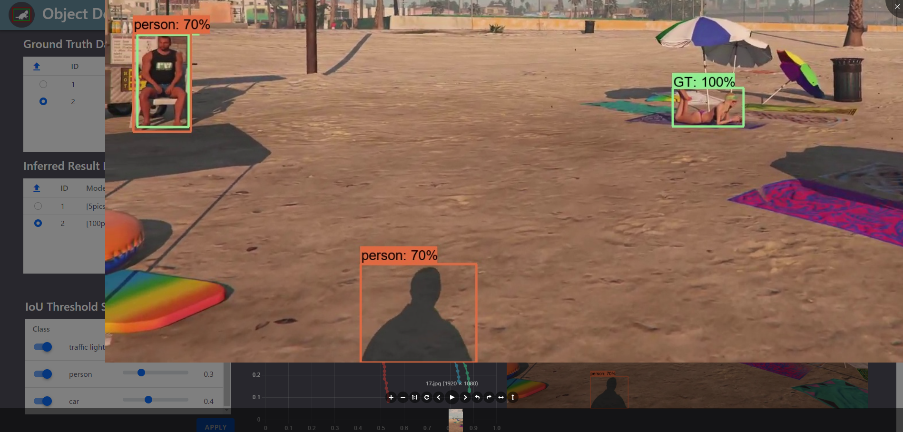
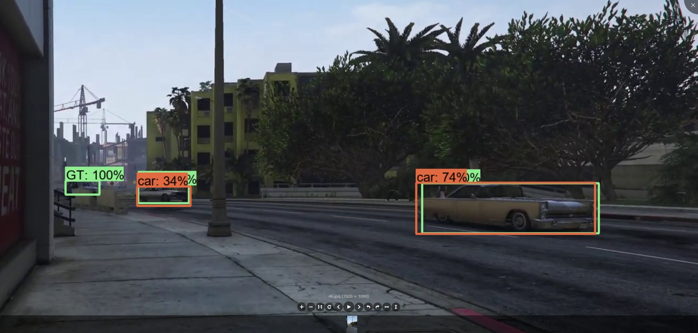

# Overview
Object Detection Evaluator is designed to help you evaluate your models with precision and efficiency. This app offers two key features: "Easy-to-Understand Performance Metrics" and "Effortless Analysis for Improvement."

There are existing metrics used in various competitions, which can be complex for individuals without a deep understanding of performance evaluation. This app simplifies the process, making it accessible to a broader end users.

Furthermore, I noticed the challenges engineers encounter when trying to improve model performance. The process of visually confirming objects in inferred images and adjusting numerous parameters for subsequent models can be time-consuming. This application streamlines these tasks with a user-friendly web interface and an intuitive analysis dashboard.



# Local Installation
Create a virtual environment.
```
create_venv.bat
```
Run the application and access it in your browser at http://127.0.0.1:80:
```
run.bat
```
Note:
* Python 3.11.x is required. <br>
* Try dataset names starting with "\[5pics]" as evaluating a large dataset may take longer depending on the environment.<br>

# Functions
## File upload
 Upload tag files (.xml) that have been annotated using [LabelImg](https://github.com/HumanSignal/labelImg) and an inference result file (.txt). The inference result file should have specific columns named "filename," "class," "left," "right," "top," "bottom," and "score." The values for the bounding boxes must be in pixels, and the score should be a value between 0 and 1.

## IoU threshold setting
Select the class name for the evaluation target and adjust the IoU threshold. The IoU threshold, which ranges from 0 to 1, is used to determine if the prediction detection box is correct or not. This threshold should be defined based on the level of accuracy required by the customer's use case.

## Performance viewer
You can view a table and a scatter chart. The table displays the best performance (Precision, Recall, F1) and the number of objects classified as a confusion matrix for each class. These performance metrics are determined based on the highest F1 score achieved when the score threshold is adjusted incrementally by 0.01 within the range of 0 to 1.

__* note: When you set these score thresholds for deployment, the model achieves the most balanced performance between precision and recall.__

The scatter chart displays a PR (Precision-Recall) curve. The horizontal axis represents recall, and the vertical axis represents precision for each class.

## Image viewer
The image data is filtered based on the number of objects in the confusion matrix as shown in the table. In the images, you'll find annotation boxes (in green) and prediction boxes (in red). This allows you to visually assess which objects have been predicted correctly or not. This helps in understanding the characteristics of false predictions and determining the next steps to improve the model's performance.



